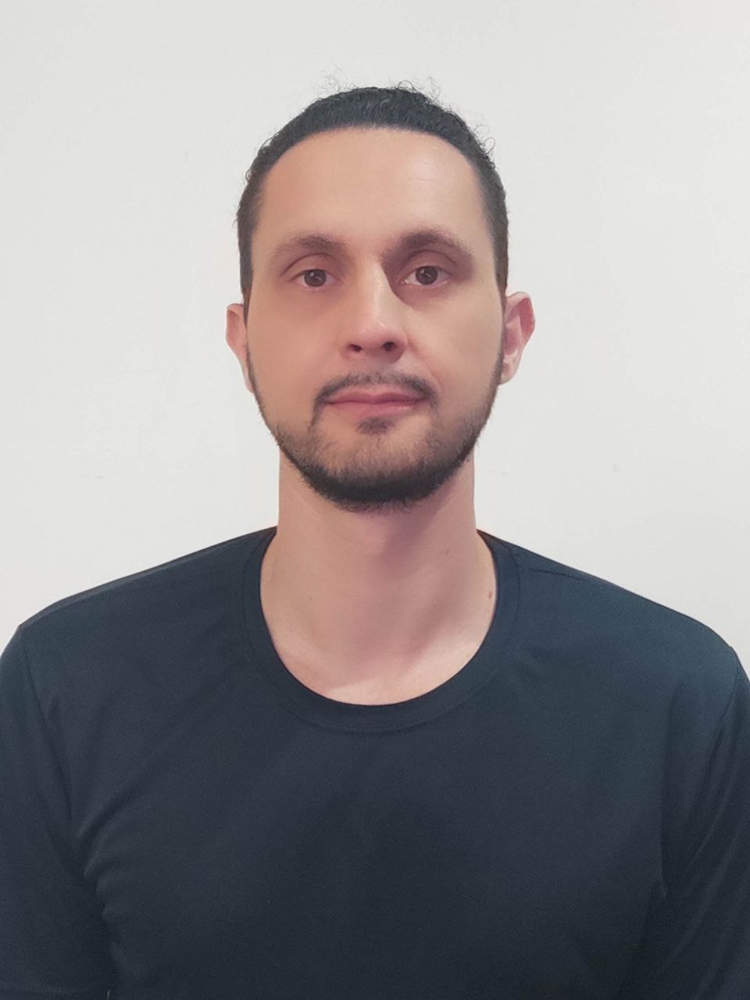

Pesquisador em GIScience, cartografia colaborativa, OpenStreetMap, análise espacial e interoperabilidade semântica.

::::{grid} 1 1 2 2
:::{grid-item}

:::

:::{grid-item}

**Doutorando em Ciências Geodésicas | UFPR**  
**Pesquisador | LAGEAMB/UFPR**  
**Visiting Researcher (2023–2024) | Heidelberg University**

Curitiba, Paraná, Brasil

[nathandamas@ufpr.br](mailto:nathandamas@ufpr.br) | [LinkedIn](https://www.linkedin.com/in/nathandamas/)

**Interesses de pesquisa:** cartografia colaborativa, OpenStreetMap, VGI, análise espacial e espaço-temporal, interoperabilidade semântica, fotogrametria, LiDAR, UAV, infraestrutura de dados espaciais e cadastro 3D.

[CV](cv/index.md) | [Publicações](publications/index.md) | [Projetos](projects/index.md) | [ORCID](https://orcid.org/0000-0002-1469-2867) | [Lattes](http://lattes.cnpq.br/3565779095318842)

:::
::::

## Projetos em destaque

::::{grid} 1 1 2 3
:::{card} OpenStreetMap e dinâmica de contribuição
:link: projects/osm-spatiotemporal-analysis.md
Análises espaço-temporais de contribuições, exclusões e maturação de dados no OpenStreetMap.
:::

:::{card} Infraestrutura geoespacial
:link: projects/geospatial-infrastructure.md
Modelagem de bancos espaciais, metadados, interoperabilidade e automação aplicada à gestão territorial.
:::

:::{card} NLP e LLMs em geotecnologias
:link: projects/nlp-llm-geospatial.md
Aplicações de processamento de linguagem natural e large language models no domínio geoespacial.
:::
::::
